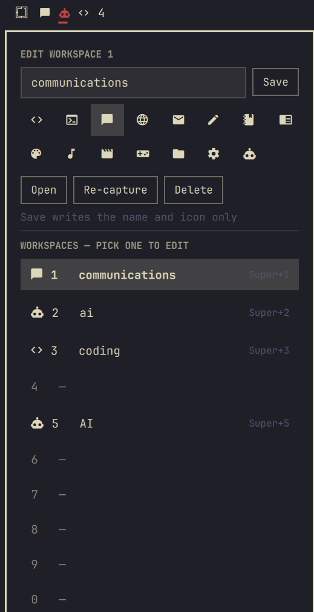

# oma-space

**Arrange a workspace the way you like it, save it, and rebuild it on demand — and see
every workspace at a glance while you work.**

oma-space replaces Omarchy's workspace numbers with one bar tab per workspace. Each tab
wears its workspace's icon, hovering it says what is open there, and a workspace you have
saved rebuilds itself — right apps, right directories, right layout — the moment you walk
onto it empty.


*Workspaces 1, 2 and 3 are saved and wear their icons — chat, agents, code. 2 is the one
you are on, so it is accented and underlined. 4 has windows but nothing saved, so it falls
back to its number. 5 through 10 are empty, so they are not on the bar at all.*

## What it does

- **A tab per workspace**, in place of `omarchy.workspaces`. Click to go there — that is
  all a click does, so a mis-click never launches anything.
- **Hover a tab** to see the workspace's name and every window open in it: app icon, app
  name, window title.
- **Capture a workspace** — its apps, their working directories, its layout, its window
  sizes — under a name and one of fifteen icons.
- **Arrive on an empty saved workspace and it fills itself.** By tab, by `Super+N`,
  however you got there.
- **Empty workspaces leave the bar**, so the strip is a picture of what you are actually
  working on rather than ten permanent numbers.

## Install

```bash
omarchy plugin add https://github.com/Tussky/omazoom.git
~/.config/omarchy/plugins/io.github.tussky.oma-space/oma-space install
omarchy restart shell
```

`omarchy plugin add` clones and validates the plugin; `oma-space install` is the step that
takes over the bar. It removes `omarchy.workspaces` from your layout and stands nine
numbered tabs and a scratch tab exactly where it stood, so nothing else on the bar moves.

Your `shell.json` is copied to `shell.json.bak` first — once, and never overwritten
afterwards, so the backup stays the bar as it was before oma-space ever touched it. On a
machine that has never customised the bar, install starts from the defaults Omarchy ships.

```bash
oma-space install --dry-run     # print the layout it would write, change nothing
oma-space install --tabs 5      # workspaces 1-5 only
oma-space install --section right
```

Full options: [`docs/install.md`](docs/install.md).

## Uninstall

```bash
oma-space uninstall             # tabs off, omarchy.workspaces back where it was
oma-space uninstall --purge     # and delete the installed plugin directory
```

**Use this rather than `omarchy plugin remove` on its own.** Omarchy's remove drops a
single bar entry per plugin id, so a strip of ten tabs would leave nine dead slots behind —
and it never puts `omarchy.workspaces` back. `oma-space uninstall` does both, and never
touches your saved workspaces: they live in `~/.config/oma-space/workspaces/` and survive
uninstalling, reinstalling and upgrading.

Full options: [`docs/uninstall.md`](docs/uninstall.md).

## Using it

| gesture | what happens |
|---|---|
| **Left click** a tab | focus that workspace. Nothing else — nothing is launched |
| **Hover** a tab | its name, its layout, and every window open in it, with `Open` for what is saved |
| **Right click** a tab | opens the panel below |
| **Arrive on an empty workspace** | if something is saved for it, it rebuilds itself |
| `omarchy-shell shell toggle io.github.tussky.oma-space` | opens the panel from a keybind or a script |

### The panel



The panel edits **one workspace at a time**, and any of the ten is one click away in the
list at the bottom — so a workspace with nothing open, which has no tab on the bar to
hover, is still two clicks from being named. The buttons are named for what each one does
to the apps on disk:

| button | writes |
|---|---|
| **Capture** | the workspace as it is right now, under the name you typed — for a slot with nothing saved |
| **Save** | the name and icon only. Apps, layout, sizes and working directories are untouched |
| **Re-capture** | replaces the saved apps with what is open now. The deliberate one |
| **Open** | rebuilds it, filling gaps and duplicating nothing |
| **Delete** | empties the slot. Asks twice; the workspace keeps its windows |

### Icons

Fifteen, in the panel: Code, Terminal, Chat, Web, Mail, Writing, Notes, Reading, Design,
Music, Video, Games, Files, System, Agents. Click one to wear it, click it again to take it
off. They are Material Design glyphs, which every Nerd Font carries — and they are a
starting set, not a limit: `icon` on a definition is any string, so an editor or
`oma-space edit --icon` can put anything there.

### Tab settings

Each tab is its own bar widget instance, so the strip is bar layout like anything else —
drag a tab, drop another widget into the middle of it, keep some of Omarchy's numbers if
you want them:

```json
"left": [
  { "id": "omarchy.menu" },
  { "id": "io.github.tussky.oma-space", "index": 1 },
  { "id": "io.github.tussky.oma-space", "index": 2, "label": "Name" },
  { "id": "io.github.tussky.oma-space", "index": 3, "pinned": true },
  { "id": "io.github.tussky.oma-space", "scratch": true }
]
```

| setting | default | what it does |
|---|---|---|
| `index` | `1` | which of Omarchy's ten this tab is attached to — the one `Super+N` reaches |
| `label` | `"Icon"` | `Icon`, `Number` or `Name`. Icon and name come from what is saved, and fall back to the number while nothing is |
| `pinned` | `false` | keep the tab on the bar while its workspace is empty |
| `scratch` | `false` | pin to workspace 10 and never save it — the one workspace with no configuration |

## Command line

Everything the bar does, from a terminal. Full interfaces in [`docs/`](docs/).

```bash
oma-space live                    # every workspace and its windows, JSON
oma-space list [--json]           # all ten workspaces and what is saved for them
oma-space capture <index>         # a workspace as a definition, JSON on stdout
oma-space save --index <n> NAME   # capture and save in one action
oma-space edit <index> --name X   # rename or re-icon, without capturing
oma-space delete <index>          # empty a slot; the workspace keeps its windows
oma-space restore <index>         # rebuild a workspace from what is saved for it
oma-space open [index]            # the same, defaulting to where you are
oma-space install | uninstall     # the tabs on and off the bar
```

`oma-space open` is worth a bind of its own in your `bindings.lua` — it fills the workspace
you are standing on and duplicates nothing, so a second press does nothing.

## How it works

QML draws; Python does everything else, the model included. The helper is stdlib-only, and
every surface reads it through one shared service, so ten tabs across two monitors are one
process answering one question.

Apps are launched by the helper rather than through Hyprland's `exec` workspace rules,
which track windows through the process environment — chromium-family apps clear theirs, so
the rule silently misses. oma-space subscribes to Hyprland's event socket first, launches
the app itself with its working directory, waits for the window, then moves it. More code,
but it works for every app, including ones already running.

Definitions are JSON in `~/.config/oma-space/workspaces/`, one file per workspace: slot `N`
is `N.json`. A workspace holds one configuration or none, which is why everything is
addressed by index and why two definitions can never claim the same `Super+N`.

## Limits

- **Single monitor in v1.** Definitions record no output, and the focused mark comes from
  Hyprland's globally focused workspace — so on a second monitor every strip marks the same
  tab. Restore puts a workspace's apps wherever that workspace currently lives.
- **Tiled window sizes are captured but not restored.** Floating windows get their exact
  size back; Hyprland takes no absolute size for a tiled window, so restore says on stderr
  when it skipped one.
- **Browser tabs are out of scope.** Hyprland reports windows, not tabs. Webapps opened
  with `omarchy-launch-webapp` are standalone windows and are captured properly.
- **One terminal, one process.** Ghostty's single-instance mode and `footclient` share one
  process across windows, so nothing ties a shell to a window; capture emits a bare
  terminal and says so rather than guessing a directory.

## Development

```bash
git clone https://github.com/Tussky/omazoom.git oma-space
cd oma-space
./oma-space install          # copies the tree into ~/.config/omarchy/plugins/
omarchy restart shell        # a changed .qml needs a restart; the shell caches components
```

Install copies rather than symlinks, deliberately: Omarchy's validator refuses a plugin
folder containing symlinks, and the watcher behind live reload is `inotifywait -r`, which
does not follow one. Keep the folder symlink-free — the helper is stdlib only, so there is
nothing to install into a virtualenv.

`prd.md` is the source of truth for what this is and why every decision went the way it
did. `docs/` holds one interface contract per verb.

## License

GPL-3.0-or-later — see [LICENSE](LICENSE).

Copyright (C) 2026 Isaac Anderson. This program is free software: you can redistribute it
and/or modify it under the terms of the GNU General Public License as published by the Free
Software Foundation, either version 3 of the License, or (at your option) any later
version. It is distributed in the hope that it will be useful, but WITHOUT ANY WARRANTY;
without even the implied warranty of MERCHANTABILITY or FITNESS FOR A PARTICULAR PURPOSE.
